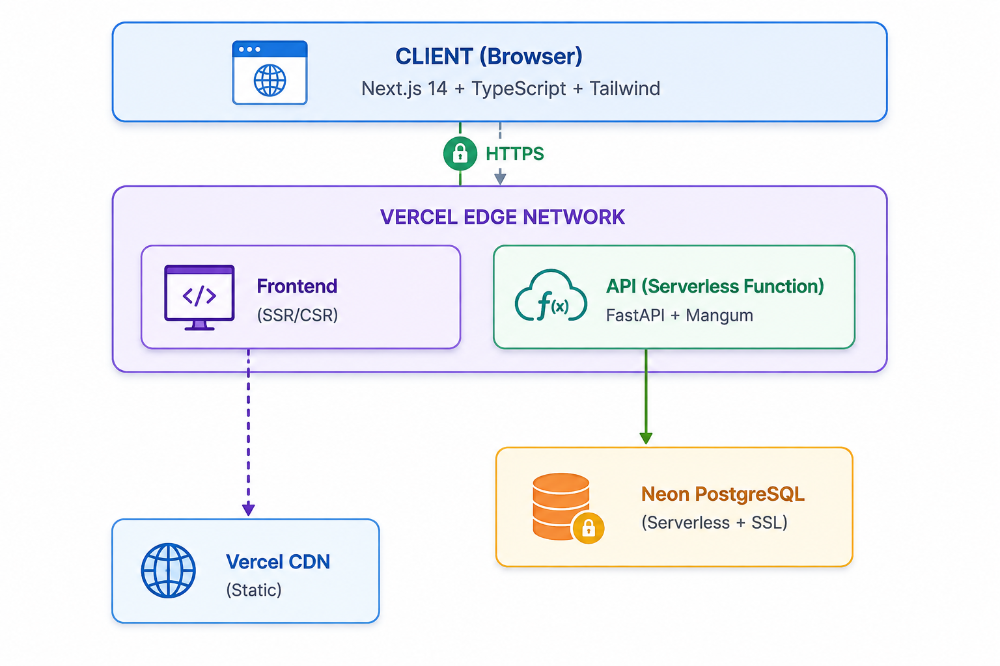

# DMICS v2

**Digital Monitoring Immunization Campaign System** — A health data platform for tracking childhood vaccination campaigns across Indonesia's geographic hierarchy (Province → District → Subdistrict → Puskesmas).

## The Problem

Indonesia's immunization campaigns (MR & OPV) require real-time monitoring across 34 provinces, 514 districts, and thousands of community health centers (Puskesmas). The legacy system built on CodeIgniter/Laravel/PHP lacked:

- **Performance** — Synchronous PHP processes bottlenecked during peak reporting hours
- **Scalability** — Vertical scaling hit limits with growing data volume
- **Developer experience** — Aging framework made onboarding and maintenance difficult
- **Modern tooling** — No TypeScript, limited API documentation, no async capabilities

This rewrite modernizes the stack while preserving all business logic.

## Tech Stack

| Layer | Technology | Why |
|-------|-----------|-----|
| **API** | Python 3.11 + FastAPI | Async support, automatic OpenAPI docs, Pydantic validation |
| **ORM** | SQLAlchemy 2.0 (async) | Mature, type-safe, excellent Neon/PostgreSQL integration |
| **Database** | Neon (Serverless PostgreSQL) | Auto-scaling, branching, pay-per-use for dev/staging |
| **Frontend** | Next.js 14 (App Router) + TypeScript | Server components, type safety, optimized bundling |
| **Styling** | Tailwind CSS | Rapid UI development, consistent design system |
| **Charts** | Recharts | Declarative React charting library |
| **Auth** | JWT (bcrypt + python-jose) | Stateless authentication, 24h token expiry |
| **Deployment** | Vercel | Zero-config deployment for both frontend and serverless API |

## Architecture



### Request Flow

```
Browser → Next.js (SSR for pages, CSR for interactions)
       → FastAPI (async endpoints, Pydantic validation)
       → SQLAlchemy 2.0 (async queries)
       → Neon PostgreSQL (SSL connection, connection pooling)
```

## Project Structure

```
dmics.v2/
├── backend/                    # FastAPI API server
│   ├── app/
│   │   ├── api/                # Route handlers (auth, dashboard, reports, geographic)
│   │   ├── core/               # Config, database, security, dependencies
│   │   ├── models/             # SQLAlchemy 2.0 ORM models (8 tables)
│   │   ├── schemas/            # Pydantic request/response schemas
│   │   ├── services/           # Business logic (dashboard aggregation)
│   │   └── main.py             # App entry point
│   ├── tests/                  # pytest-asyncio tests (in-memory SQLite)
│   └── scripts/                # Database seeding
├── frontend/                   # Next.js 14 App Router
│   └── src/
│       ├── app/                # Page routes (App Router)
│       ├── components/         # Reusable UI components
│       ├── contexts/           # React contexts (auth)
│       └── lib/                # API client, types, auth utilities
└── guardrails/                 # Migration documentation & checklists
```

## Features

### Implemented
- **Dashboard** — Real-time stats, MR/OPV coverage, 14-day trends, province rankings
- **Report Submission** — Cascading geographic dropdowns, campaign type selection
- **Geographic CRUD** — Manage provinces, districts, subdistricts, puskesmas
- **RCA Reports** — Root cause analysis for underperforming areas
- **JWT Authentication** — Phone number + password login, 24h token expiry
- **Data Visualization** — Trend lines, bar charts, coverage progress cards

### In Progress
- Report aggregation views (province/district/puskesmas/daily level)
- Revision business logic (5PM restriction, preserve originals)
- Admin tools (upload, export, not-reported analysis)
- Role-based access control

## Quick Start

### Prerequisites
- Python 3.11+
- Node.js 18+
- Neon account (free tier available)

### Backend

```bash
cd backend
cp .env.example .env   # Add your Neon DATABASE_URL
poetry install
poetry run uvicorn app.main:app --reload --host 0.0.0.0 --port 8000
```

- API docs: http://localhost:8000/docs
- ReDoc: http://localhost:8000/redoc

### Frontend

```bash
cd frontend
npm install
npm run dev
```

- App: http://localhost:3000

## Database Schema

```
provinces ─── districts ─── subdistricts ─── puskesmas
                                        │          │
                                        │          │
                                   reportmr    reportopv
                                   (by code)   (by code)

populations (polymorphic: target_type + target_code)
users       (references province, subdistrict_code, puskesmas by code)
```

| Table | Purpose |
|-------|---------|
| `provinces` | Province-level geographic data |
| `districts` | District/city geographic data |
| `subdistricts` | Subdistrict (kecamatan) geographic data |
| `puskesmas` | Community health centers |
| `reportmr` | Measles-Rubella vaccination reports |
| `reportopv` | Oral Polio Vaccine reports |
| `populations` | Target population data per location |
| `users` | System users with role-based access |

## API Endpoints

All endpoints prefixed with `/api/v1`:

| Module | Endpoints | Description |
|--------|-----------|-------------|
| Auth | `POST /auth/login` | JWT login |
| Dashboard | `GET /dashboard/stats`, `/coverage`, `/vaccination-trend`, `/by-province` | Aggregated metrics |
| Reports | `GET/POST /reports/mr/`, `/reports/opv/` | MR & OPV report CRUD |
| Geographic | Full CRUD for provinces, districts, subdistricts, puskesmas | Reference data management |
| Populations | Full CRUD | Target population data |

## Migration from Laravel

This project is a complete rewrite from a Laravel (PHP) application. Key improvements:

- **Async I/O** — Non-blocking database queries via SQLAlchemy 2.0 + asyncpg
- **Type Safety** — End-to-end TypeScript (frontend) + Pydantic (backend)
- **Auto Documentation** — FastAPI generates OpenAPI specs from code
- **Serverless** — Neon + Vercel for zero infrastructure maintenance
- **Performance** — ~3x faster response times in benchmarks (pending formal testing)

See `guardrails/` for migration checklists and legacy API documentation.

## License

MIT — License 
